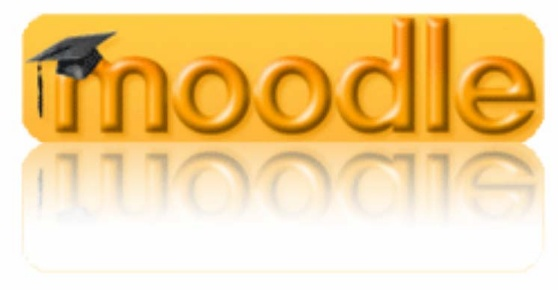

## 🖥️ Medien

### 🧭 Medienkonzept

Grundlage unserer Überlegungen zur Medienerziehung ist der hier in
Auszügen zitierte Text „Medienerziehung in der Schule --
Orientierungsrahmen der Bund-Länder-Kommission für Bildungsplanung und
Forschungsförderung":

„Bildung ist zu allen Zeiten von Medien unterstützt, aufrechterhalten,
vertieft, aber auch verändert worden. Bücher, Texte und Bilder sind die
klassischen Bildungsmedien der Schule.

Hinzugekommen sind die elektronischen Medien mit neuen Ausdrucksformen
und Wirkungsweisen. Medien sind Miterzieher geworden. Sie können
Kommunikation erleichtern und bieten Orientierung an. Medien greifen
Themen des gesellschaftlichen Lebens auf und wirken sich so stark auf
die persönliche Lebensgestaltung schon in früher Kindheit und Jugend
aus, dass Bildung und Erziehung in Elternhaus und Schule tiefer und
unmittelbarer als früher betroffen sind. Die insbesondere über die
elektronischen Medien an Kinder und Jugendliche herangetragenen
Informationen, Probleme und Wertorientierungen überdecken in ihrer
Wirkung oft die Bedeutung familiärer Erziehung und schulischer Bildung.
Es muss deshalb von einer veränderten Bildungssituation, d.h. auch von
veränderten Lernvoraussetzungen und Lernmöglichkeiten in der Schule
ausgegangen werden."

Vor dem Hintergrund dieser Entwicklung bestehen Chance und Aufgabe der
Schule darin, die Nutzungs- und Gestaltungsmöglichkeiten der Medien in
ihrem Wert anzuerkennen, sie zugleich in ihren Wirkungen durchschaubar
zu machen und diese ggf. zu korrigieren. Die Medienwelt und der von ihr
ausgehende Bildungseinfluss sowie die von der Schule verantworteten
Bildungsprozesse sollten zusammengesehen werden. Schule und Medien
müssen ihre je eigenen und spezifischen Funktionen im Bildungsgeschehen
erkennen und wahrnehmen.

Daraus ergeben sich für die Umsetzung in der Schule verschiedene Ziele:

- Schulen können die Medien nutzen, um das Lehren und Lernen zu
  verbessern,

- Schüler\*innen sollen Medien einsetzen, um sich Informationen und
  Wissen zu verschaffen, sie sollen die Hilfe von Medien zum Lösen von
  Problemen und Treffen von Entscheidungen einschätzen lernen,

- sie sollen mit Medien gestalten und ihre Kreativität entwickeln,

- nicht zuletzt sollen sie den Gebrauch von Medien beurteilen, kritisch
  bewerten und diese in ihren gesellschaftlichen Zusammenhängen sehen
  und

- der Umgang mit Medien sollte sachgerecht, selbstbestimmt, kreativ und
  sozial verantwortlich sein!

Die Medien sollten altersgemäß eingesetzt und die Fähigkeiten der
Schüler\*innen systematisch entwickelt werden mit dem Ziel ein aktives,
individuelles und motivierendes Lernen zu erreichen. Dazu ist es
notwendig, dass die Lehrkräfte über die entsprechende Medienkompetenz
verfügen.

In den Lehrplänen ist die Medienerziehung in allen Jahrgangsstufen
vorgesehen. Die Beschäftigung mit ihnen ist eine übergreifende,
integrative Erziehungsaufgabe, an der alle Fächer in unterschiedlichem
Rahmen beteiligt sind.

Unser Mediencurriculum wird in Zusammenarbeit aller Fächer ständig
weiterentwickelt.

Die Übersicht zeigt den als verbindlich beschlossenen Medieneinsatz in
den einzelnen Stufen:

| Jgst.  | Unterrichtseinheit / Projekt                                                                                                                                                                 | Fach       | Unterrichtsinhalte / Medienbezüge                                      | Software                                               |
|--------|---------------------------------------------------------------------------------------------------------------------------------------------------------------------------------------------|------------|------------------------------------------------------------------------|--------------------------------------------------------|
| 5/6    | Die Computer im Schulnetz Benutzungsregeln der Computerräume, des SLZ und des Internets („Netiquette“), Technik der Internetnutzung, Nutzung des Schulnetzwerks: Account, Home-Ordner, Speichern/Laden                                                      | M, D, etc. | –                                                                      | Betriebssystem, Browser, Word                          |
| 5/6    | Geometrie, Größen, Bruchrechnung                                                                                                                                                    | M          | Koordinatensystem, Vielecke, Tabellen (ohne Berechnungen)            | Euklid Dynageo, GeoGebra, Word, Excel                  |
| 5/6    | Klassenzeitung                                                                                                                                         | D          | –                                                                      | Word                                                   |
| 5/6    | Mediennutzung |  Umfragen/Interviews, Stellungnahme zur Mediennutzung, Bewusstmachen eigener Gewohnheiten                                                                                       | D          | Medienverhalten analysieren                                           | Internet                                               |
| 7      | Algebra, Geometrie | M          | Lineare Gleichungen, Geraden,  Prozent-, Zinsrechnung,  Dreieckskonstruktionen                                                             | Euklid Dynageo, WinPlot, Excel              |
| 8      | Projekt „Medienkompetenz im Web 2.0“                                                                                                                  | Projekttage | Internet- und Medienkompetenz                                         | Internet (*facebook* etc.)                            |
| 8      | Projekt Zeitung (ZEUS)                                                                                                                                | D          | Druckerzeugnisse                                                       | Word, Publisher                                        |
| 11     | Facharbeiten                                                                                                                                          | alle       | Präsentationen                                                         | unterschiedliche Medien, PowerPoint                   |

### 🌐 Blended Learning mit MOODLE, eTwinning und dropbox

Blended Learning bezeichnet die Form des
Kernens, die durch die Kombination von Lernangeboten in Präsenzphasen im
Unterricht und Selbstlernphasen unter Benutzung digitaler Medien über
eine Internet-Plattform. Untersuchungen zeigen einen erhöhten Lernerfolg
durch die Ansprache vieler Lernkanäle. MOODLE ist die
Open-Source-Plattform zur Erstellung und Verwendung von
Unterrichtsmaterialien.

Schon im Jahr 2008 erarbeitete eine Gruppe von deutschen und
niederländischen Lehrern aus der EuRegio Rhein-Maas-Nord
Unterrichtsreihen im MINT-Bereich, die das Konzept Blended Learning mit
MOODLE benutzen. Das GREM war mit mehreren Lehrern von Anfang an dabei.

Das Projekt war der Startpunkt für den Einsatz von MOODLE in vielen
Schulen der EuRegio. Auch am GREM wird Blended Learning mit MOODLE als
Unterrichtsmethode eingesetzt. Die Materialien, die größtenteils von den
Lehrern erstellt worden sind, liegen dabei sicher geschützt auf Servern
des kommunalen Rechenzentrums KRZN im Internet und sind von den
Schüler\*innen jederzeit auch zuhause erreichbar.

Die EU richtete eTwinning ein, um den
Informationsaustausch europäischer Schulen in diversen Projekten zu
unterstützen. Mittels einer einfach zu bedienenden Internet-Plattform
arbeiten mehrere Partnerklassen in gemeinsamen Unterrichtsprojekten
zusammen. Dabei werden die Werkzeuge Chat, Email, Webspace und Forum im
Unterricht und von zuhause aus eingesetzt. Die Ergebnisse können
anschließend zum Beispiel als Website oder Wiki präsentiert werden.

Wir nutzen eTwinning im Rahmen unserer Comenius-Projekte, aber auch im
„normalen" Unterricht, um das Blended Learning zu fördern.

Immer häufiger genutzt wird die „cloud" als gemeinsamer Speicherort für
unterrichtsrelevante Dateien; zu nennen ist hier insbesondere der
kostenfreie Dienst „dropbox". Wir bevorzugen jedoch die Nutzung unserer
MOODLE-Plattform wegen der besonders geschützten Server des
Rechenzentrums Niederrhein.