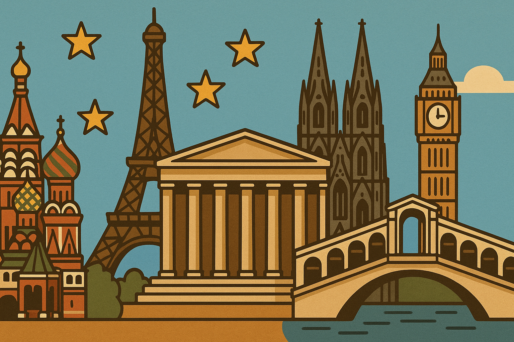

## 🌍 Europa

Der europäische Gedanke ist eine der vier tragenden Säulen unseres Schulprofils am GREM. Als zertifizierte Europaschule des Ministeriums für Schule und Bildung des Landes Nordrhein-Westfalen ist es uns ein zentrales Anliegen, unsere Schülerinnen und Schüler in der Entwicklung interkultureller, sprachlicher und methodischer Kompetenzen zu stärken – Fähigkeiten, die für ein Leben in einem kulturell vielfältigen, demokratischen und vernetzten Europa unerlässlich sind.

### 🗣️ Bilingualer Bildungsgang – Sprachliche Vielfalt mit Tradition
Als Gymnasium mit einem bilingualen Bildungsgang beginnt der Ausbau sprachlicher Kompetenzen bereits in der Erprobungsstufe mit zusätzlichen Englischstunden. Diese bereiten unsere Schülerinnen und Schüler gezielt auf den bilingualen Fachunterricht in Erdkunde, Geschichte und Biologie ab der Mittelstufe vor.

Der bilinguale Zweig hat am GREM eine über 30-jährige Tradition und steht exemplarisch für die enge Verzahnung von sprachlichem und fachlichem Lernen. In der Oberstufe kann dieser Weg weitergeführt werden – mit der Möglichkeit, das Exzellenzlabel CertiLingua für mehrsprachige, europäische und internationale Kompetenzen zusätzlich zum Abitur zu erwerben.

### 🌐 Fremdsprachenangebot – Brücken bauen durch Sprache
Das GREM bietet ein breites Spektrum moderner Fremdsprachen an:

- Französisch
- Latein
- Niederländisch
- Italienisch

Mit diesem Sprachenangebot fördern wir nicht nur das Verständnis europäischer Kulturräume, sondern ermöglichen zugleich gezielte Perspektivenvielfalt für Studium, Beruf und internationale Begegnungen.

### 🤝 Europa im Ganztag – Projekte, AGs und gelebte Vielfalt
Auch im Rahmen unseres Ganztagskonzepts setzen wir klare europäische Akzente. Schülerinnen und Schüler erleben Europa aktiv in Kursen und AGs wie:

- „Wir in Europa“
- Erasmus+-AG,
- Debating Club
- Juniorbotschafter-Gruppe

Projektkurse mit internationaler Ausrichtung in der Sekundarstufe II.

So entstehen internationale Kontakte und Freundschaften, die über den Unterricht hinaus wirken und Europa im Schulalltag spür- und erfahrbar machen.

### 🌍 Austausch, Projekte & Wettbewerbe – Europa praktisch erleben
Durch unsere Teilnahme an Erasmus+-Programmen, Schüleraustauschen, internationalen Projektarbeiten und europäischen Wettbewerben wie z. B. dem Europäischen Wettbewerb oder Model European Parliament, werden Horizonte erweitert und globale Kompetenzen gefördert. Diese Erfahrungen stärken nicht nur die Sprachpraxis, sondern auch die soziale Verantwortung und Teamfähigkeit unserer Schülerinnen und Schüler.

### 🎓 Europäische Qualifikationen – Vorbereitung auf die Zukunft
Mit Blick auf Studium und Beruf bieten wir gezielte Zusatzqualifikationen an, etwa:

- das bilinguale Zertifikat,
- Sprachprüfungen wie DELF (Französisch), ele.IT (Italienisch), CNaVT (Niederländisch) und VPET (Englisch),
- die CertiLingua-Auszeichnung.

Diese Abschlüsse erweitern den individuellen Bildungserfolg und sind bei Hochschulen und Arbeitgebern international anerkannt.

### 🏅 Ausgezeichnetes Engagement
Unser europäisches Engagement wurde mehrfach gewürdigt – das GREM trägt u. a. die Titel:

- Europaschule
- Erasmus+ Schule
- Euregioprofilschule sowie
- Botschafterschule des Europäischen Parlaments.

Diese Auszeichnungen spiegeln unser gelebtes Leitbild wider:
Wir leben Europa – im Unterricht, im Schulleben und darüber hinaus.
